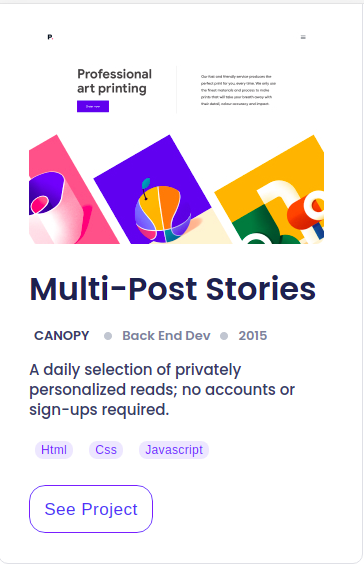

# Project Name
 Portfolio setup for mobile version skeleton

 
 
 
 
 
  

## Built With

-HTML
-CSS

## Getting Started

To get a local copy up and running follow these simple example steps.

### Prerequisites

-Have git install on your local machine

### Setup

-Clone the repository 

-Run on your machine

## Author
👤 **Author**

[Github](https://github.com/gbengacode)
[Linkedin](https://www.linkedin.com/in/emmanuel-gbenga/)

## 🤝 Contributing

Contributions, issues, and feature requests are welcome!

## Acknowledgments

My fellow coding partners
