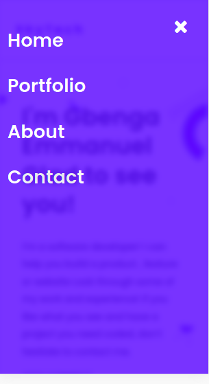

# Project Name
 Portfolio setup for mobile version skeleton

 
 
 
 
 
 
 
 
 
 
 
 
 
 
## Built With

- HTML
- CSS
- JAVASCRIPT

## Live Demo

[View Live Demo Site](https://gbengacode.github.io/Setup-mobile-version-porfolio/)

## Getting Started

To get a local copy up and running follow these simple example steps.

### Prerequisites

- Have git install on your local machine

### Setup

- Clone the repository to your machine

- Run on your browser

## Author
👤 **Author**

[Github](https://github.com/gbengacode)
[Linkedin](https://www.linkedin.com/in/emmanuel-gbenga/)

## 🤝 Contributing

Contributions, issues, and feature requests are welcome!

## Acknowledgments

My fellow coding partners
